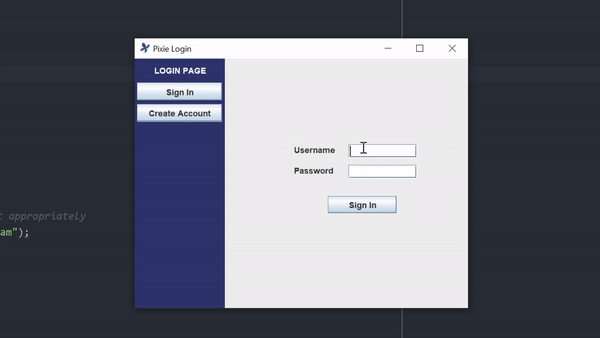

# social-posting-app-final-project

## about
* app that allows users to create, edit, and delete posts, comments, and profiles
* collaborated on for 2.5-week final project from July to August 2021 for a Java CS course
* contributors
    * Charles Graham (responsible for back end)
    * Nathan Yao (responsible for front end and middleware)
    * Mentions: Sami Heathcote, Jasmine Maduafokwa, Mingrui Xia

## features
1. data persists regardless of whether program is running
2. handling crash circumstances
3. ability of user to create, edit, and delete their accounts, posts, and comments
4. ability of users to obtain a feed of all posts made on app
5. use of GUI to handle all user interactions
6. ability to support multiple concurrent users over a network
7. ability to view real-time updates (content updates automatically without refresh)
8. user can import or export a post from or to a CSV file
9. ability to search for another user and view their profile, posts, and comments

## overview

